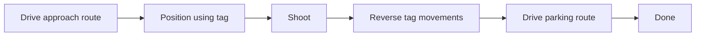

# Reading the BIOBUZZ robot code

These programs are for FIRST Tech Challenge (FTC). Start with one robot action at a time. You can use a helper class by understanding its
public methods before studying the calculations inside it. All new OpModes are disabled
drafts. Start with the [setup and operating guide](biobuzz-quick-start.md) to choose a
program and find its calibration exercise. Commissioning means checking and calibrating
the assembled robot before using it.

You do not need to understand every class on the first day. Read sections 1 and 2,
trace the basic driver controls on paper, then add one robot action at a time.

## 1. Follow the driver’s inputs

Open [StarterBotTeleOp.java](../TeamCode/src/main/java/org/firstinspires/ftc/teamcode/biobuzz/StarterBotTeleOp.java).
Read `loop()` first. It drives from the sticks, reads the triggers, requests launcher speed,
decides whether to feed, and writes intake power. Every pass uses the latest gamepad inputs.

`robot` is an **object**: one instance of the `StarterRobot` class. The expression
`robot.arcadeDrive(forward, rotate)` calls that object's method with two numbers.
`StarterRobot` connects to the hardware and shares common output code between programs.
Each OpMode has its own robot object; autonomous does not inherit the manual driver's loop.

Trace these inputs on paper: sticks centered, right trigger halfway, and right bumper
released. Which devices run? Then hold the bumper. Why does feeding wait for wheel speed?

## 2. Learn when the robot software calls your methods

An **OpMode** (operation mode) is a program selected on the Driver Station. The FTC
**SDK** (software development kit) is the library that connects our Java program to the
robot hardware and Driver Station. It calls these methods:

| Method | When it runs | What belongs here |
|---|---|---|
| `init()` | Once at INIT (initialize) | Connect hardware and construct helpers. |
| `init_loop()` | Repeatedly before START | Read selections and show them in telemetry. |
| `start()` | Once at START | Reset the timer and begin the first action. |
| `loop()` | Repeatedly after START | Read sensors, update the current action, show progress. |
| `stop()` | At STOP | Cancel active actions, zero outputs, close the camera. |

`@Override` tells Java that this method supplies behavior defined by the SDK's `OpMode`.
These programs return from `loop()` promptly. They do not wait inside a loop for a wheel
to arrive; the SDK must have opportunities to process Stop and call the next loop.

## 3. Start one drive, then check its progress

Open [StarterBotDriveCalibration.java](../TeamCode/src/main/java/org/firstinspires/ftc/teamcode/biobuzz/StarterBotDriveCalibration.java).
Trace a D-pad UP selection: `chooseDriveInches(24)` chooses a forward drive of 24 inches.
`chooseTurnDegrees(-90)` chooses a left turn of 90 degrees.
`start()` checks the commissioning conditions and starts that command. `loop()` updates it.

The essential pattern below assumes `drive` and `timer` were created in `init()` and the
start checks passed. It is a reading example, not a complete deployable OpMode:

```java
// Once, when this action begins:
drive.driveInches(24, timer.seconds());

// On each later loop:
StarterDrive.Result result = drive.update(timer.seconds());
if (result == StarterDrive.Result.DONE) {
    // The command finished. The OpMode may begin its next action.
} else if (result == StarterDrive.Result.FAULT) {
    // Motion stopped because a check failed. Read drive.reason().
}
// RUNNING means: return from this loop and check again on the next one.
```

Do not put `driveInches(24, ...)` in every loop: each call starts a new command relative to
the current position. Use seconds from the same timer for the start and all updates.
The drive remembers its target, start time, and result in **fields** between method calls.
`Result` is an **enum**: a small list of named choices, here RUNNING, DONE, and FAULT.

`turnDegrees(90, now)` uses the same pattern and turns right. Negative angles turn left;
negative drive distances go backward. The **IMU** (inertial measurement unit) is the Hub
sensor we use to measure heading; encoders measure wheel travel.
Try explaining why reaching only the left wheel's distance must not finish a drive command.

## 4. Add camera aiming

Open [StarterBotAimTeleOp.java](../TeamCode/src/main/java/org/firstinspires/ftc/teamcode/biobuzz/StarterBotAimTeleOp.java).
Its loop makes each decision explicitly:

1. `TargetSelection` remembers which alliance and cell the driver selected.
2. `HiveAim.update(...)` reads that target and evaluates the camera observation.
3. `updateDriving()` chooses stick driving or stationary aiming while A is held.
4. `updateLauncherAndIntake()` spins on right bumper and feeds only when all required conditions pass.

`HiveAim.turn()` suggests turning power; the OpMode applies it through `StarterRobot`.
`mayFeed()` checks camera/commissioning conditions; the OpMode also checks buttons and speed.
A missing or stale target means held aiming commands zero movement and withholds feeding.
The baseline TeleOp and Aim TeleOp have different feed permissions: compare their loops.

## 5. Read a sequence of actions

Read `AutoShot` before the full autonomous program. Its **state** remembers which action
is happening now: SPINUP, FEED, DONE, or FAULT. Each `update()` checks whether to stay in
that state or change to another. `StarterLauncher` turns that decision into hardware outputs.

Next read `StarterBotTagCalibration`. `TagDrive` uses camera measurements to approach and
records the movements so it can return afterward. Call `tagDrive.stop()` to cancel a tag
action; it stops both the coordinator and its underlying drive. Let only one controller
own the wheels at a time. Do not mix direct drive commands with an active tag action.

Finally read `StarterBotPositionAuto.loop()`. Its `switch` selects the current action:



This is the normal shooting path. DRY_RUN skips shooting; PARK_ONLY goes from approach to
parking. Target loss can skip shooting and attempt a trusted return. A drive fault stops
the run. Trace the actual branches in `loop()` to find each exception.

## Class map: open the next file only when you need it

All Java files below live in `TeamCode/src/main/java/org/firstinspires/ftc/teamcode/biobuzz/`.
Class comments explain who calls each helper and whether it controls hardware.

| Class | Responsibility |
|---|---|
| `StarterBotTeleOp` | Basic manual gamepad decisions. Start reading here. |
| `StarterBotAimTeleOp` | Manual driving plus held aiming and assisted feed permission. |
| `StarterBotDriveCalibration` | One drive or turn for a measurement exercise. |
| `StarterBotTagCalibration` | One tag approach and return, without shooting. |
| `StarterBotPositionAuto` | Coordinates the complete autonomous sequence. |
| `StarterRobot` | Hardware names, initialization, basic outputs, and shutdown shared by OpModes. |
| `StarterDrive` | One distance/turn command, its progress, and estimated local position. |
| `TagDrive` | Tag approach/return coordination, motion recording, and stall checks. |
| `TagApproach` | Camera-based forward/turn decisions, without hardware access. |
| `DriveCheckpoint` | Named encoder counts and heading saved by `TagDrive`; no behavior. |
| `StarterLauncher` | Applies an autonomous shot's phase to the wheel, intake, and feeder. |
| `AutoShot` | Shot timing and phase decisions, without hardware access. |
| `HiveAim` | Camera connection, selected target readings, alignment, and feed permission. |
| `TargetSelection` | Remembers alliance/cell choices and allowed button presses. |
| `AutoRoutes` | Route data; its `Route` holds a card and its `Step` holds one movement. |
| `StartTagCheck` | Optional comparison with a route's measured starting camera view. |
| `HubHeading` | Actual IMU mounting, initialization, and heading readings. |
| `HeadingSource` | Interface promising a heading reading; real IMU and test doubles both implement it. |
| `HeadingMath` | Angle calculations and the `Pose` position estimate. |
| `DriveMath` | Wheel-geometry exercises and the `Completion` settling timer. |
| `AimMath` | Camera-value checks and turn/range calculations. |

The small math and decision classes allow tests without a robot. Keeping those separate
also means changing a gamepad button need not change the drive or camera calculations.
The JUnit test files in `TeamCode/src/test/java/` use fake hardware and are advanced reading, not prerequisites
for the student exercises.

## Java and robotics terms used here

- **`private` / `public`:** private details belong inside a class; public members can be used by its callers.
- **`final`:** that variable cannot be assigned again. A final robot reference can still operate its motors.
- **`static`:** belongs to the class; call `AimMath.turn(...)` without making an `AimMath` object.
- **`boolean`:** true or false. `&&` means both conditions must be true; `!` means “not.”
- **`||`:** “or”; at least one condition must be true. `==` compares two values; `=` assigns a value.
- **`if` / `else`:** choose which instructions to run based on a condition.
- **`return`:** leave the current method now, optionally sending a result to its caller.
- **Array / index:** an ordered list / a position in that list. Java starts counting positions at zero.
- **`switch` / `case` / `break`:** choose instructions for a named state / one choice / leave the switch.
- **`condition ? a : b`:** choose `a` when the condition is true, otherwise choose `b`.
- **NaN / `Double.isFinite`:** NaN means “Not a Number.” We use it for an unavailable measurement; the check rejects it and infinity.
- **Tolerance / dwell:** how close is acceptable / how long the value must remain acceptable.
- **Proportional gain:** the multiplier that turns an error into requested correction power; see the worked example below.
- **Pose:** estimated position and heading. Our X/Y coordinates start at the robot's starting point.

## What did `KP` mean?

`Kp` (sometimes written `KP` or Kₚ) is the conventional symbol for **proportional gain**:
K denotes a multiplying coefficient and P means proportional. “Proportional” means that,
before applying a limit, doubling the error doubles the requested correction power.
The code now uses names such as `TURN_PROPORTIONAL_GAIN` instead of `KP`.

For a gain of 0.015 power per degree:

| Size of angle error | Error × gain | Power magnitude after a 0.18 limit |
|---|---|---|
| 5 degrees | 5 × 0.015 = 0.075 | 0.075 |
| 10 degrees | 10 × 0.015 = 0.15 | 0.15 |
| 20 degrees | 20 × 0.015 = 0.30 | 0.18 |

The sign determines left/right; this table shows only the size of the correction.
`AimMath` converts the camera's left-positive bearing into our right-positive drive command.
Distance gains use **power per inch** instead. For example, `RANGE_PROPORTIONAL_GAIN = 0.035`
and a +2-inch range error request +0.07 forward power. Gain and maximum power are different
settings: one determines how strongly error affects the request; the other limits it.

Our drive and aiming calculations use proportional control. The launcher also uses the
SDK's **PIDF** speed controller: proportional, integral, derivative, and feedforward.
P responds to the current speed error; I to accumulated error; D to how error changes;
F supplies expected output for the requested speed. `StarterRobot.init()` names each of
the four vendor values. They use different scaling from the drive/aim gains and should
not be copied between controllers. This is an explanation of the existing settings,
not an instruction to tune them before hardware qualification.

## Abbreviations and hardware words

The names below also occur in SDK examples or the commissioning guide. Team-owned setting
names now spell out `DEGREES`, `INCHES`, `MINIMUM`, and `MAXIMUM` instead of shortening them.
Java library type names must retain their exact spelling.

| Term | Meaning in this project |
|---|---|
| FTC / SDK | FIRST Tech Challenge / software development kit, the robot programming library. |
| OpMode / TeleOp / Auto | Operation mode / tele-operated (driver-controlled) / autonomous (program-controlled). |
| INIT | Initialize: connect devices and prepare the selected program before Start. |
| IMU | Inertial measurement unit; we use the Hub's orientation sensor to measure heading. |
| `DcMotor` / `DcMotorEx` | Direct-current motor interface / extended motor interface, including velocity control. |
| `CRServo` | Continuous-rotation servo: power controls speed and direction, rather than a requested angle. |
| PIDF / `PIDFCoefficients` | Proportional, integral, derivative, feedforward / the SDK object containing those four settings. |
| NaN | Not a Number; marks an unavailable measurement or a timer that has not started. |
| RPM / ticks per second | Revolutions per minute / encoder counts per second. Conversion requires the motor's ticks per revolution. |
| RB / D-pad | Right bumper / directional pad on the gamepad. Our instructions spell out “right bumper.” |
| X, Y, Z / XY range | Camera sideways, forward, and upward axes / distance using only X and Y. A tilted camera changes their relationship to the floor. |
| USB | Universal Serial Bus; the labeled Hub connectors are also a reference for mounting orientation. |
| I2C | Inter-Integrated Circuit, pronounced “eye-squared-see”; the sensor communication bus shown in robot configuration. |
| REV | REV Robotics, the manufacturer name on the Hub; it is not a variable or measurement. |
| JDK / JAR | Java Development Kit (compiler and runtime tools) / Java Archive (packaged Java classes). Used in software-check instructions. |
| M2 / M3 / M4 | Class meetings 2, 3, and 4 in the lesson references. |
| TU01 / TU02 | Team Update 01 / 02, the numbered game-manual updates cited in the commissioning guide. |

**Telemetry** is information sent to the Driver Station screen. **Yaw** is rotation about
the vertical axis; **heading** is the direction the robot faces. **Bearing** is the target's
angle from the camera's center line. **Pitch** is up/down tilt. **Camera intrinsics** are lens
calibration values used to convert image measurements into angles and distances.
**Dead reckoning** means estimating position from accumulated movement; wheel slip causes error.

For settings, powered exercises, and route qualification, use the
[commissioning guide](biobuzz-starterbot.md). For software checks, see
[its test instructions](biobuzz-starterbot.md#run-the-current-software-checks).
